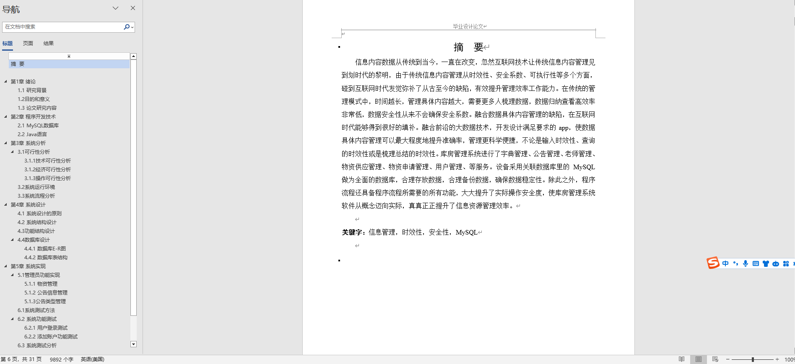
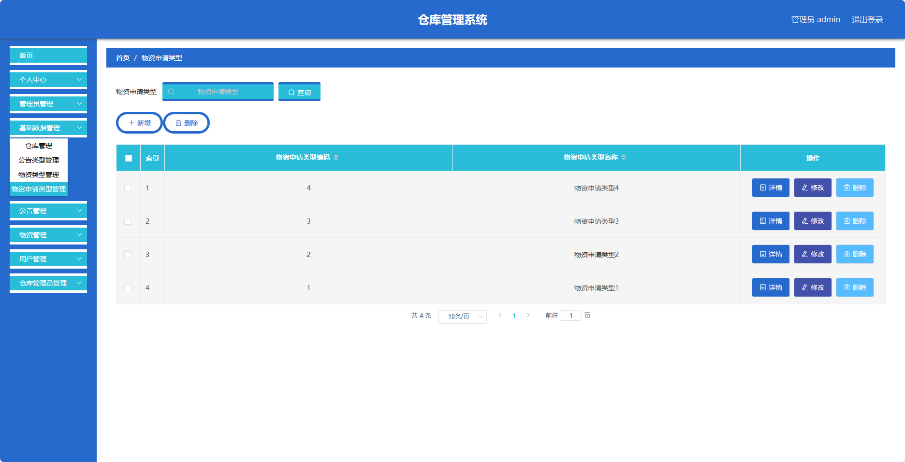
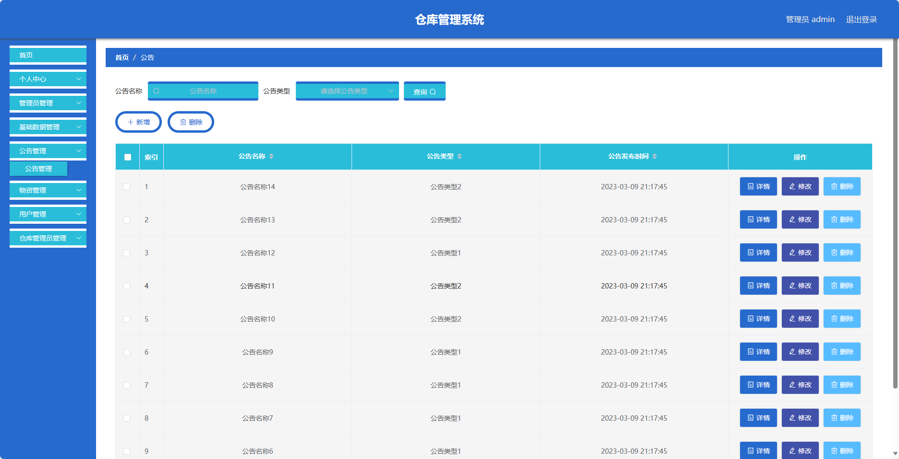
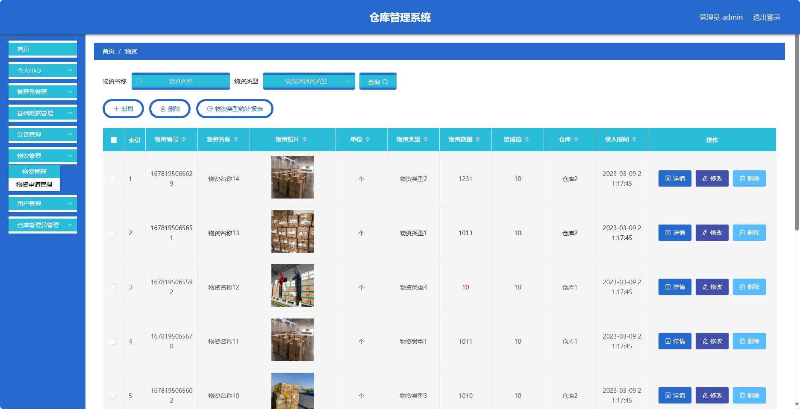
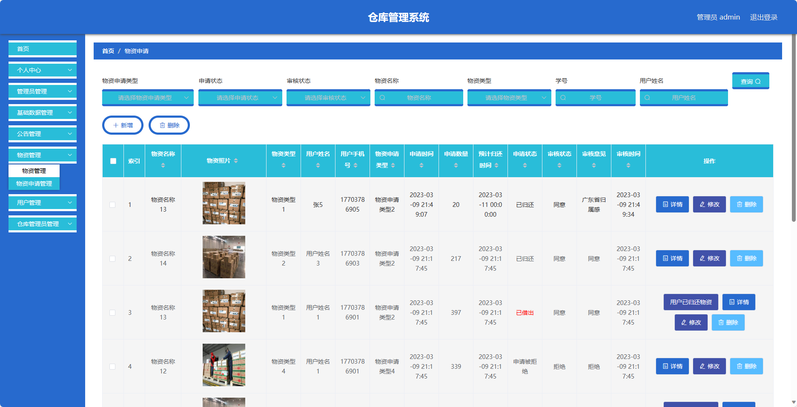
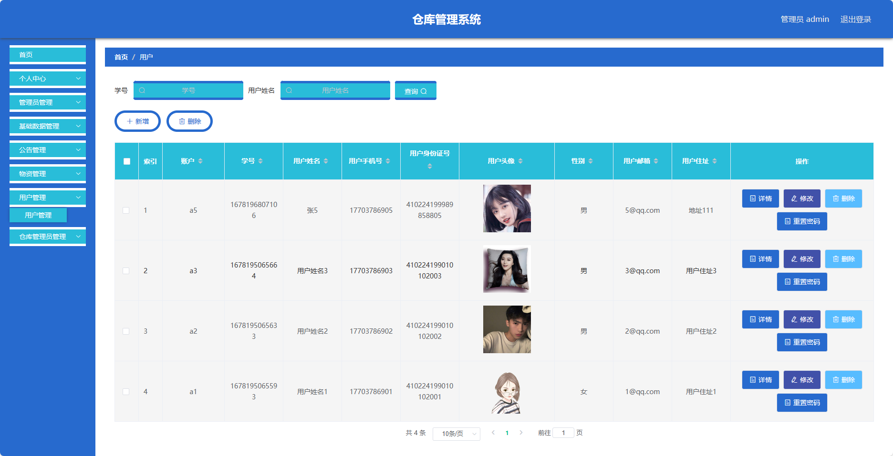

## 基于Spring Boot的仓库管理系统(程序+报告)

###  获取sql数据库文件: 从戎源码网 (https://armycodes.com/) QQ: 386869957 QQ群: 377586148
###  所有系统地址: (https://github.com/YuLin-Coder/AllProjectCatalog) 
###  所有项目以及源代码本人均调试运行无问题 可支持远程安装部署调试、定制修改、代码讲解

## 项目介绍
基于Spring Boot的仓库管理系统，系统包含三种角色：管理员、仓库管理员，用户,主要功能如下。

### 【管理员】：
- 个人中心：管理员可以查看和编辑个人信息。
- 管理员管理：管理员可以对其他管理员进行管理，包括添加、编辑和删除管理员账号。
- 基础数据管理：管理员可以管理系统的基础数据，包括分类、标签等信息的添加、编辑和删除。
- 公告管理：管理员可以发布和管理系统的公告信息，包括添加、编辑和删除公告。
- 物资管理：管理员可以管理系统的物资信息。
- 用户管理：管理员可以管理用户账号，包括查看用户信息、禁用用户账号等操作。
- 仓库管理员管理：管理员可以分配和管理仓库管理员的权限和职责。

### 【仓库管理员】：
- 个人中心：仓库管理员可以查看和编辑个人信息。
- 公告管理：仓库管理员可以发布和管理仓库的公告信息，包括添加、编辑和删除公告。
- 物资管理：仓库管理员可以管理仓库的物资信息，包括物资的添加、编辑和删除，以及库存管理和报损处理。
- 物资申请管理：仓库管理员可以处理用户对物资的申请。

### 【用户】：
- 个人中心：用户可以查看和编辑个人信息。
- 公告管理：用户可以查看系统和仓库发布的公告信息。
- 物资管理：用户可以浏览和搜索系统和仓库的物资信息。
- 物资申请管理：用户可以申请借用系统和仓库的物资。

## 项目技术
- 编程语言：Java
- 数据库：MySQL
- 项目管理工具：Maven
- 前端技术：VUE、js、css
- 后端技术：Spring、SpringMVC、MyBatis

## 运行环境
- JDK版本：JDK1.8及以上
- 开发工具：IDEA、Ecplise、Myecplise都可以
- 数据库: MySQL5.7及以上
- Maven：maven3.0及以上
- Node：14.14.0及以上

## 运行截图

